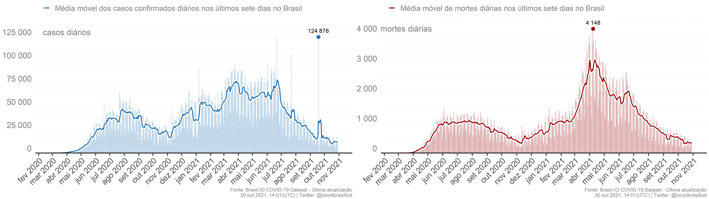

# covidbrasilbot

Source for the Twitter bot [@covidbrasilbot](https://www.twitter.com/covidbrasilbot). It posts daily reports about the number of confirmed cases and deaths caused by COVID-19 in Brazil using [{rtweet}](https://docs.ropensci.org/rtweet/) and [GitHub Actions](https://docs.github.com/en/actions). Built by [@ramongss](https://twitter.com/ramongss), inspired by the [@londonmapbot](https://twitter.com/londonmapbot) created by [@mattdray](https://twitter.com/mattdray).

# What

This repo contains a [GitHub Action](https://github.com/features/actions) that runs on schedule (every day at 00:30 UTC). It executes the R code that retrieves the COVID-19 data from [Wesley Cota's Github repo (wcota/covid19br)](https://github.com/wcota/covid19br), summarizes the information, generates the graphs with the confirmed cases and deaths info, and creates a "micro-report" to be posted. The report and the graphs are posted to [@covidbrasilbot](https://www.twitter.com/covidbrasilbot) on Twitter using [{rtweet}](https://docs.ropensci.org/rtweet/) package.

# Report example (in PT-BR)

:calendar: 29 de Out. de 2021

:brazil: #Brasil soma 21.797.940 casos confirmados e 607.722 óbitos por #COVID19, com 12.138 novos casos e 397 novos óbitos.

:bar_chart: A incidência máxima de:

:face_with_thermometer: casos confirmados foi de 124.878 em 18 de Set. 2021;

:skull: óbitos foi de 4.148 em 08 de Abr. 2021.

